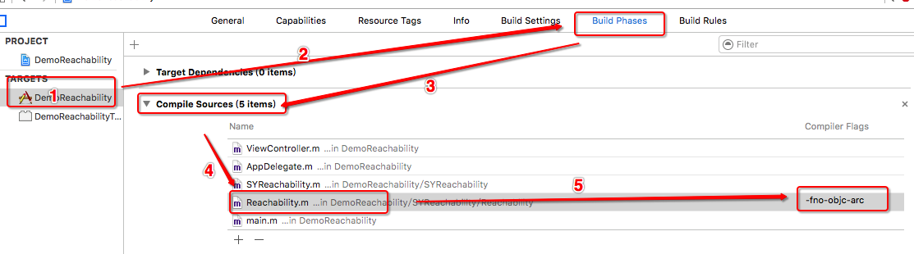

# SYReachability
使用Reachability库进行二次封装，用于监测网络状态

#效果图

~~~ javascript

// 导入头文件
#import "Reachability.h"

- (BOOL)application:(UIApplication *)application didFinishLaunchingWithOptions:(NSDictionary *)launchOptions {
// Override point for customization after application launch.

    // 开启网络状态监听
    [[SYReachability shareReachability] startNetworkStatusNotifier];

    // 使用
    NSString *message = @"";
    // 方法1
    if ([[SYReachability shareReachability] NetworkStatus] == kNotReachable)
    {
        message = @"无网络";
    }
    else if ([[SYReachability shareReachability] NetworkStatus] == kReachableViaWWAN)
    {
        message = @"无限广域网";
    }
    else if ([[SYReachability shareReachability] NetworkStatus] == kReachableViaWiFi)
    {
        message = @"WiFi环境";
    }

    // 方法2
    message = (isNotReachable ? @"无网络" : (isWifi ? @"WiFi环境" : @"无限广域网"));

    [[[UIAlertView alloc] initWithTitle:@"当前网络状态" message:message delegate:nil cancelButtonTitle:nil otherButtonTitles:@"知道了", nil] show];

    return YES;
}

~~~

#使用注意
 * 因为Reachability是MRC内存管理模式，所以如果加入到ARC管理内存模式的项目中时，需要添加参数"-fno-objc-arc"以适配ARC内存管理。设置方法如下图所示。
 

